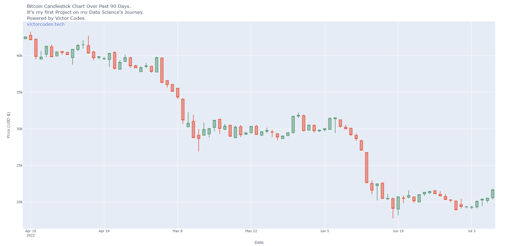
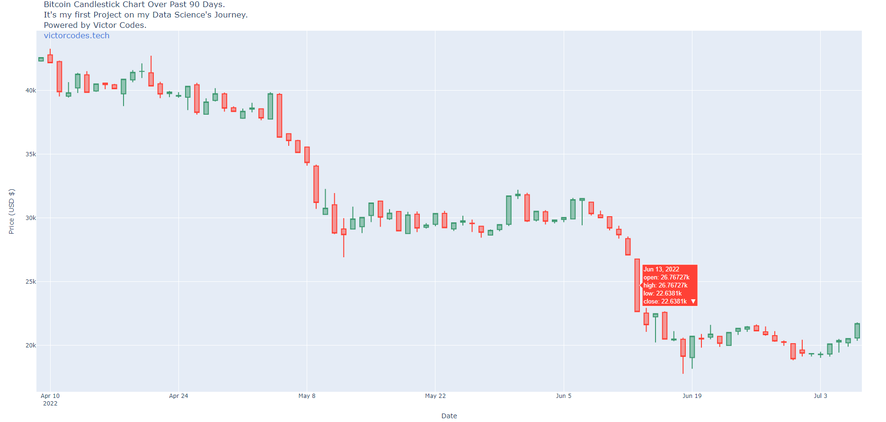

<h1 align="center">

<p>

 My First Project on the Data Science Journey! 🪙📈
</p>

</h1>

## 📕 About

It is a **Simple Project** that get data from **CoinGecko** and plots a graph, but how it is **my first project** on my path to **become a Data Analyst**, i decided to share. It always takes the data of the last 90 days and makes the candlestick with the information of opening, closing, maximum and minimum.

## 🛠️ Tools 

- [CoinGeckoAPI](https://www.coingecko.com/en/api) - Imported from pycoingecko
- [Plotly](https://plotly.com/python/) - Imported **plotly.offline** and **plotly.graph_objs**

## ♻️ How Contribute

```bash
 # Clone the project
    $ git clone https://github.com/victorvadl/project_bitcoin_chart.git
```

```bash
 # Enter directory
    $ cd project_bitcoin_chart
```

```bash
 # Install the dependencies, if use npm
    $ npm install
```
<p align="center">or</p>

```bash
 # Install the dependencies, if use yarn
    $ yarn
```

## 🎢 See the code working



